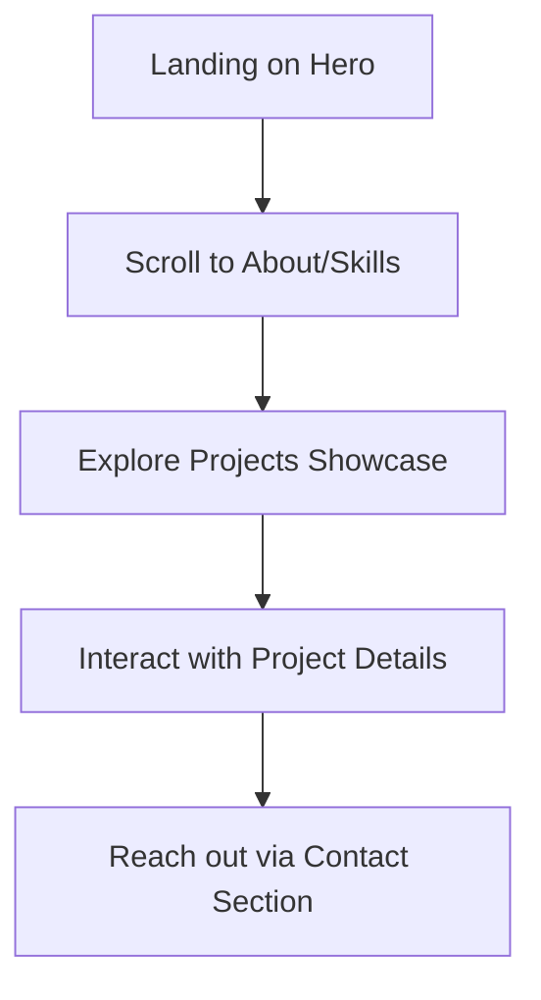

## 1. Product Overview
A modern, sleek, and high-end portfolio web page designed to showcase the user's projects, skills, and professional experience.
- The primary purpose is to impress potential clients, recruiters, and collaborators with a visually striking and technically flawless digital presence.
- The target value is to stand out from generic portfolios through exceptional typography, smooth motion, and a refined, memorable aesthetic.

## 2. Core Features

### 2.1 User Roles
Not applicable. This is a public-facing portfolio website with no authentication required.

### 2.2 Feature Module
1. **Hero Section**: High-impact introduction, large typography, and a distinct call-to-action.
2. **About/Experience Section**: Professional background, skills, and brief biography.
3. **Projects Showcase**: Interactive grid or list of featured work with rich visuals and hover effects.
4. **Contact Section**: Simple, elegant form or direct links for communication.

### 2.3 Page Details
| Page Name | Module Name | Feature description |
|-----------|-------------|---------------------|
| Home page | Hero section | Full-screen height, dramatic typography, subtle entrance animations. |
| Home page | About section | Clean layout highlighting skills and a brief personal summary. |
| Home page | Projects grid | Asymmetrical or masonry layout with image reveals on hover. |
| Home page | Contact footer | Minimalist contact links and social icons with magnetic hover effects. |

## 3. Core Process
When a visitor lands on the site, they are guided through a carefully curated narrative of the user's professional journey, ending with a clear path to connect.

## 4. User Interface Design
### 4.1 Design Style
- **Primary and secondary colors**: Deep, inky black background (`#050505`), pure white text (`#ffffff`), and a vibrant electric violet accent (`#7c3aed`) for interactions.
- **Button style**: Minimalist, pill-shaped or sharp rectangular outlines with fill-on-hover animations.
- **Font and sizes**: 
  - Display Font: `Syne` or `Cabinet Grotesk` for massive, characterful headings.
  - Body Font: `Satoshi` or `General Sans` for clean, highly legible paragraphs.
- **Layout style**: Asymmetrical grid, generous negative space, breaking out of traditional constraints.
- **Icon/emoji style suggestions**: Thin, sharp line icons (e.g., Lucide React). No emojis, to maintain a high-end, sleek tone.

### 4.2 Page Design Overview
| Page Name | Module Name | UI Elements |
|-----------|-------------|-------------|
| Home page | Hero section | Massive typography, staggered text reveal animation, subtle noise texture overlay. |
| Home page | Projects grid | Large high-contrast imagery, monochrome to color on hover, custom cursor interaction. |

### 4.3 Responsiveness
Desktop-first design with careful scaling down to mobile. On mobile, the asymmetrical grid simplifies to a single column, but retains the high-end typographic hierarchy and smooth scroll animations.

### 4.4 3D Scene Guidance
Not applicable for this 2D web portfolio, though a subtle WebGL noise or fluid background could be considered if performance allows. (Sticking to CSS/SVG for maximum performance and sleekness).