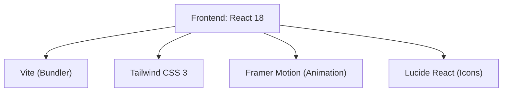

## 1. Architecture Design

## 2. Technology Description
- **Frontend Framework**: React@18
- **Styling**: tailwindcss@3 (with a custom configuration for a dark, sleek theme)
- **Animation**: framer-motion for page transitions and scroll reveals
- **Icons**: lucide-react for sharp, minimalist line icons
- **Build Tool**: vite
- **Routing**: react-router-dom (if multiple pages are needed, else single-page scroll)

## 3. Route Definitions
| Route | Purpose |
|-------|---------|
| / | The primary, single-page scroll portfolio showcasing hero, about, projects, and contact sections. |

## 4. API Definitions
Not applicable. The portfolio relies on static data structured locally within the React application. No backend or database is necessary for the initial version.

## 5. Server Architecture Diagram
Not applicable (Frontend only).

## 6. Data Model
Not applicable. Static project data will be maintained in a constant array within the frontend source code.